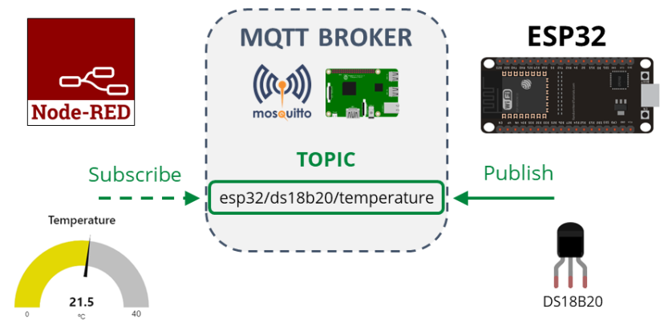
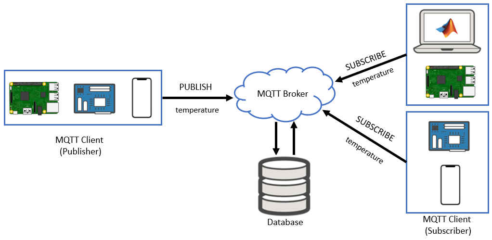
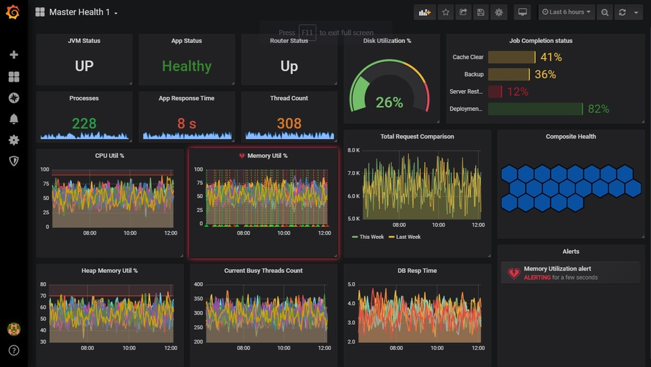

#### Objective

The objective of this experiment is to simulate and understand the process of sending live sensor data to an IoT cloud platform using the **MQTT (Message Queuing Telemetry Transport)** protocol with **ESP8266 and ESP32** microcontrollers.

This experiment focuses on **lightweight communication**, **publish–subscribe architecture**, **Quality of Service (QoS)** levels, and **real-time data transfer**, which are critical concepts for large-scale and resource-constrained IoT systems.

#### Introduction

The Internet of Things (IoT) enables interconnected devices to collect, exchange, and analyze data over the internet. As IoT devices are often deployed in environments with limited bandwidth, low power availability, and unstable network conditions, efficient communication protocols are essential.

While **HTTP** follows a synchronous request–response communication model, it introduces overhead due to headers and repeated connections. To address these limitations, **MQTT** was specifically designed for IoT and machine-to-machine (M2M) communication. MQTT is a **lightweight**, **event-driven**, and **bandwidth-efficient** protocol that supports real-time data transmission with minimal resource usage.

This experiment demonstrates how ESP8266 and ESP32 use MQTT to publish live sensor data to an IoT platform, enabling scalable and reliable real-time monitoring.

#### ESP8266 and ESP32 as MQTT-Based IoT Nodes

ESP8266 and ESP32 are widely used in MQTT-based IoT systems due to the following features:

- Built-in **Wi-Fi connectivity**
- Integrated **TCP/IP stack**
- Compatibility with popular **MQTT client libraries**
- Low power consumption
- Ability to handle real-time sensor data efficiently

In this experiment, ESP8266 / ESP32 function as **MQTT clients** that acquire sensor data, format it into messages, and publish it to an MQTT broker over a Wi-Fi network.

  
*Source: Espressif Systems Documentation*

#### IoT System Architecture Using MQTT

An MQTT-based IoT system follows a decoupled communication architecture consisting of the following components:

1. **Sensors**  
   Sensors measure physical or environmental parameters such as temperature, humidity, gas concentration, or distance.

2. **ESP8266 / ESP32 (Publisher)**  
   Reads sensor data, processes it, and publishes messages to MQTT topics.

3. **MQTT Broker**  
   Acts as a central message hub that receives messages from publishers and distributes them to subscribers.

4. **Subscribers / IoT Dashboard**  
   Subscribe to specific topics and receive sensor updates in real time.

Unlike HTTP, MQTT does not require direct communication between sender and receiver, making it highly scalable.

  
*Source: MQTT Protocol Architecture*

#### MQTT Protocol Overview

MQTT (Message Queuing Telemetry Transport) is a **lightweight messaging protocol** based on the **publish–subscribe communication model**. It runs over TCP/IP and is optimized for devices with limited processing power and memory.

##### Key Characteristics of MQTT

- Lightweight and bandwidth-efficient  
- Asynchronous communication  
- Runs over TCP/IP  
- Supports unreliable networks  
- Ideal for low-power IoT devices  

MQTT is particularly suitable for:
- Remote monitoring systems  
- Real-time sensor data streaming  
- Large-scale IoT deployments  

#### Publish–Subscribe Communication Model

##### Publisher
- ESP8266 / ESP32 publishes sensor data
- Messages are sent to a specific **topic**

##### Broker
- Receives messages from publishers
- Filters and routes messages based on topics
- Manages client connections

##### Subscriber
- Subscribes to one or more topics
- Automatically receives updates when new data is published

This model **decouples data producers and consumers**, improving scalability and system reliability.

#### MQTT Topics and Messages

MQTT uses **topics** to organize and filter messages.

- Topics are hierarchical strings  
- Example topics:
  - `lab/sensors/temperature`
  - `lab/sensors/humidity`

Each MQTT message consists of:
- **Topic** – Identifies message category  
- **Payload** – Contains sensor data  

Payload formats may include:
- Plain text  
- JSON  

Structured topics enable scalable and organized IoT communication.

#### Sensor Data Acquisition and Publishing Process

The complete data flow in this experiment includes:

1. Sensors are interfaced with ESP8266 / ESP32  
2. Sensor values are read using ADC or digital pins  
3. Raw data is processed and converted into meaningful units  
4. Sensor data is formatted into an MQTT payload  
5. Payload is published to a predefined MQTT topic  
6. Broker distributes data to subscribed clients  

This process enables **near real-time updates** with minimal latency.

#### MQTT Broker and IoT Platform

An MQTT broker acts as the central server for message exchange.

##### Key Broker Functions
- Topic-based message routing  
- Client authentication  
- Session management  
- Message persistence  

IoT platforms using MQTT typically provide:
- Real-time dashboards  
- Graphical data visualization  
- Alerts and notifications  
- Device and topic management  

Common MQTT brokers and platforms include:
- Mosquitto  
- HiveMQ  
- EMQX  
- Cloud-based IoT dashboards  

  
*Source: MQTT IoT Platform Documentation*

#### Quality of Service (QoS) Levels in MQTT

MQTT provides three Quality of Service (QoS) levels to balance reliability and performance:

| QoS Level | Description |
|----------|------------|
| QoS 0 | At most once – Fast delivery, no guarantee |
| QoS 1 | At least once – Guaranteed delivery |
| QoS 2 | Exactly once – Highest reliability |

QoS selection depends on application requirements such as latency tolerance and reliability needs.

#### Security Considerations in MQTT Communication

MQTT-based IoT systems require proper security mechanisms to prevent unauthorized access and data breaches.

Common security techniques include:
- Client authentication using username and password  
- TLS/SSL encryption for secure communication  
- Access control on MQTT topics  

Although basic simulations may not implement full security, understanding these concepts is essential for real-world IoT deployments.

#### Applications of MQTT-Based IoT Systems

MQTT is widely used in various IoT domains, including:

- Smart agriculture monitoring  
- Industrial IoT (IIoT) systems  
- Smart home automation  
- Environmental monitoring platforms  
- Healthcare IoT solutions  

#### Conclusion

This experiment provides an in-depth understanding of MQTT-based IoT communication using ESP8266 and ESP32 microcontrollers. It highlights the advantages of the publish–subscribe model, lightweight communication, and QoS mechanisms, making MQTT a preferred protocol for scalable and real-time IoT applications.

#### References

1. MQTT Version 3.1.1 Specification – OASIS  
2. Espressif Systems ESP8266 & ESP32 Documentation  
3. IoT Communication Protocols – IEEE  
4. HiveMQ MQTT Essentials Guide  
5. Internet of Things: Principles and Paradigms – Rajkumar Buyya  

